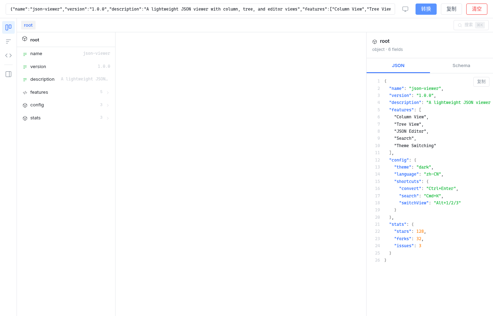
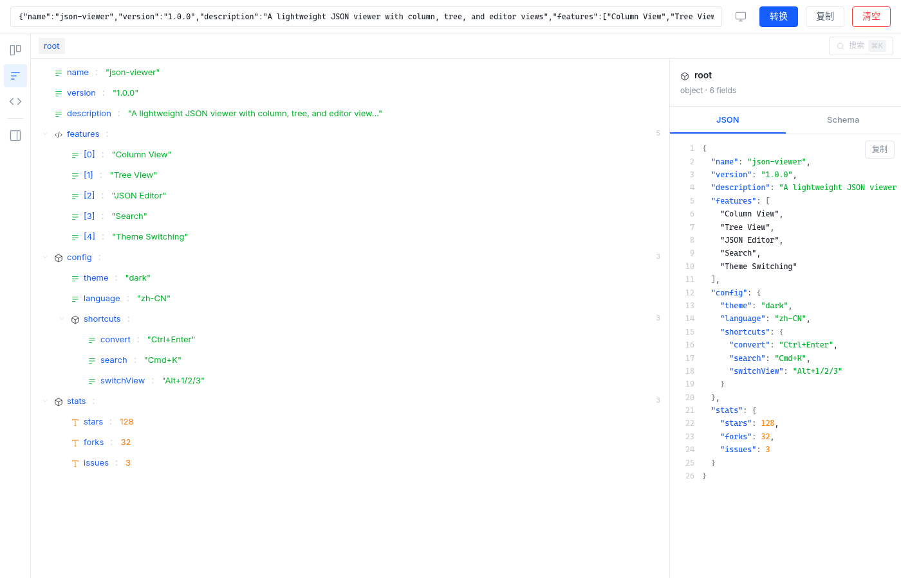
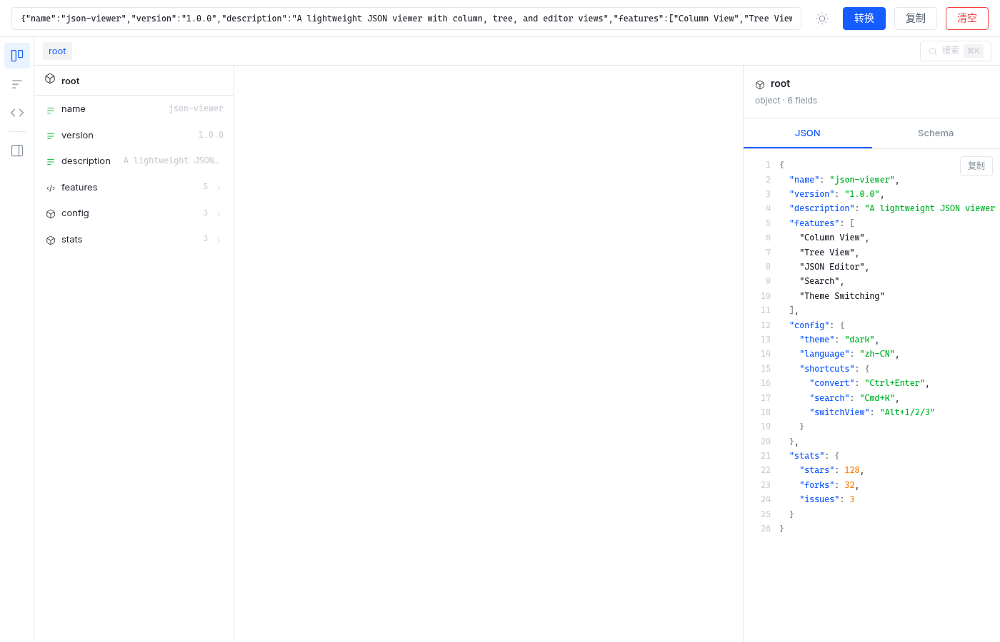

# JSON Viewer

一个轻量级的 JSON 查看器，支持多种数据格式输入和三种可视化视图。

> 零构建、零依赖，打开浏览器即可使用。

## 功能特性

- **多格式输入** — 支持 JSON、Python 字典（单引号 + `None`/`True`/`False`）、转义 JSON 字符串
- **列视图** — macOS Finder 风格的列式浏览，逐层展开
- **树视图** — 可折叠/展开的树形结构，带缩进线
- **编辑器视图** — 语法高亮 + 行号的 JSON 格式化显示
- **信息面板** — 查看选中节点的 JSON 或自动生成的 Schema
- **搜索** — 全局搜索 key 和 value，支持键盘导航
- **主题切换** — 跟随系统 / 亮色 / 暗色，偏好持久化
- **面包屑导航** — 快速跳转到任意祖先节点

## 在线使用

直接访问：`https://<your-username>.github.io/json-viewer/`

## 本地使用

无需安装任何依赖，下载 `index.html` 后用浏览器打开即可：

```bash
# 方法 1：直接打开
open index.html        # macOS
xdg-open index.html    # Linux

# 方法 2：本地服务器（可选）
python3 -m http.server 8080
# 访问 http://localhost:8080
```

## 截图

### 暗色模式





### 亮色模式




## 键盘快捷键

| 快捷键 | 功能 |
|---|---|
| `Ctrl` / `⌘` + `Enter` | 转换输入数据 |
| `Ctrl` / `⌘` + `K` | 打开搜索 |
| `Alt` + `1` | 切换到列视图 |
| `Alt` + `2` | 切换到树视图 |
| `Alt` + `3` | 切换到编辑器视图 |

## 技术栈

- [Vue 3](https://vuejs.org/) — 渐进式 JavaScript 框架（CDN 加载）
- [Arco Design](https://arco.design/) — 字节跳动设计系统（CSS Token）
- 纯 CSS 自定义属性实现主题系统
- 无构建工具，单文件部署

## 与 JSON Hero 的区别

本项目基于 [JSON Hero](https://github.com/StevenTCampbell/json-hero-web) 改造，主要变更：

| | JSON Hero | JSON Viewer |
|---|---|---|
| **技术栈** | React + Remix + TypeScript + 构建工具 | Vue 3 单文件，零构建 |
| **部署方式** | 需要 Node.js 运行时 | 浏览器直接打开 `index.html` |
| **输入格式** | 仅 JSON | JSON / Python 字典 / 转义 JSON |
| **文件大小** | ~数 MB（含 node_modules） | ~55 KB 单文件 |
| **主题系统** | 固定暗色 | 跟随系统 / 亮色 / 暗色三态切换 |
| **信息面板** | JSON 视图 | JSON + Schema 自动生成 |
| **语言** | 英文 | 中文 |

**保留的核心功能：** 列视图、树视图、编辑器视图、搜索、面包屑导航、快捷键

## Acknowledgments

本项目基于 [JSON Hero](https://github.com/StevenTCampbell/json-hero-web) 改造，感谢原作者 Steven Occhialini 的开源贡献。

## License

[MIT](LICENSE) — 基于 [JSON Hero](https://github.com/StevenTCampbell/json-hero-web) (MIT) 改造
